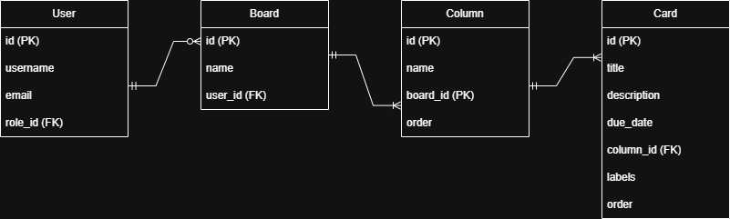

# SupTaskFlow

SupTaskFlow est une application de gestion de tâches basée sur un
système Kanban (tableaux, colonnes, cartes) un peu comme Trello.

Le projet est composé de deux parties :
-   Backend : Strapi
-   Frontend : React + TypeScript

------------------------------------------------------------------------

# 1. Schéma relationnel des données



Organisation des données :

-   Un utilisateur peut créer plusieurs boards.
-   Un board contient plusieurs colonnes.
-   Une colonne contient plusieurs cartes.

---

- USER -> BOARD : un utilisateur peut posséder plusieurs boards (1..N)
- BOARD -> COLUMN : un board contient une ou plusieurs colonnes (1..N)
- COLUMN -> CARD : une colonne contient une ou plusieurs cartes (1..N)

Chaque board est lié à son créateur afin que l'API ne renvoie que les
boards de l'utilisateur connecté.

------------------------------------------------------------------------

# 2. Procédure d'installation

## Prérequis

-   Node.js 20+
-   npm

## Installation

Depuis la racine du projet :

``` bash
cd backend
npm install

cd ../frontend
npm install
```

## Lancer le backend

``` bash
cd backend
npm run dev
```

Le serveur démarre sur :

http://localhost:1337

## Lancer le frontend

``` bash
cd frontend
npm run dev
```

Application disponible sur :

http://localhost:5173

------------------------------------------------------------------------

# 3. Variables d'environnement

## Backend (backend/.env)

    HOST=0.0.0.0
    PORT=1337
    APP_KEYS="key1,key2"
    API_TOKEN_SALT=secret
    ADMIN_JWT_SECRET=secret
    TRANSFER_TOKEN_SALT=secret
    JWT_SECRET=secret
    ENCRYPTION_KEY=secret

Base de données SQLite par défaut :

    DATABASE_CLIENT=sqlite
    DATABASE_FILENAME=.tmp/data.db

## Frontend (frontend/.env)

    VITE_API_URL=http://localhost:1337/api

------------------------------------------------------------------------

# 4. Choix techniques

## Backend

Strapi v5 est utilisé comme Headless CMS pour gérer les données et
exposer une API REST.

## Frontend

React + TypeScript avec Vite pour créer une interface dynamique et
réactive.

## Bibliothèques utilisées

-   axios : requêtes HTTP
-   react-router-dom : navigation
-   @dnd-kit/core et @dnd-kit/sortable : drag & drop
-   lucide-react : icônes
-   Tailwind CSS : style

------------------------------------------------------------------------

# 5. Guide utilisateur

## Authentification

-   création de compte
-   connexion
-   déconnexion

## Boards

-   créer un board
-   ouvrir un board
-   supprimer un board

## Colonnes

-   ajouter une colonne
-   renommer une colonne
-   supprimer une colonne

## Cartes

-   créer une carte
-   modifier le titre
-   ajouter une description
-   ajouter une date limite
-   ajouter des labels
-   supprimer une carte

## Drag & Drop

Les cartes peuvent être déplacées entre colonnes. La position est
sauvegardée et reste la même après rechargement de la page.